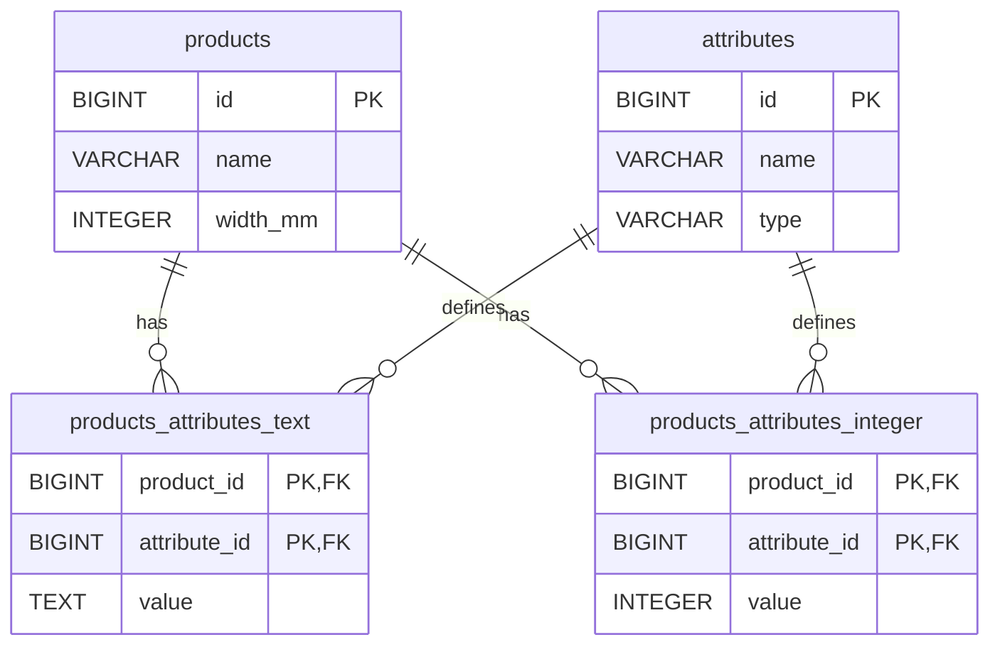

# これは何？
リユース業務のドメインをまとめ、
その横断ドメインであろう商品ドメインについて、
知見を深めるために、簡易的なコードを作成したもの（しているもの）。

- [これは何？](#これは何)
- [リユース業務のドメイン](#リユース業務のドメイン)
- [リユース業務系の販売管理システム](#リユース業務系の販売管理システム)
  - [1. Must](#1-must)
  - [2. Should](#2-should)
  - [3. Nice to have](#3-nice-to-have)
- [簡易プロトタイプ構成（初期開発向け）](#簡易プロトタイプ構成初期開発向け)
- [横断ドメインである商品](#横断ドメインである商品)
  - [4. 検討する内容](#4-検討する内容)
  - [5. 試作](#5-試作)
    - [5.1. 検証用 github URL:](#51-検証用-github-url)
    - [5.2. 動かし方](#52-動かし方)
      - [5.2.1. Vue を Spring Boot から配信](#521-vue-を-spring-boot-から配信)
      - [5.2.2. 開発時（Vueは別サーバーでホットリロード）](#522-開発時vueは別サーバーでホットリロード)
    - [5.3. システム構成](#53-システム構成)
    - [5.4. 環境（WSL2）](#54-環境wsl2)
    - [5.5. DB設計](#55-db設計)
    - [5.6. 実施項目](#56-実施項目)
    - [5.7. 結果（検証途中）](#57-結果検証途中)

# リユース業務のドメイン
1. 商品
   - 商品マスタの管理（年代、デザイン。型番号？複数ドメインで共通？）
   - 商品ライフサイクル・ステータス管理（ステータス（修理、出品、返品）と、その遷移日時）

1. 買取
   - 商品の検索（査定時利用。商品関連性の検索。買取履歴の検索。）
   - 買取査定ロジック（状態、トレンド、在庫数？ほかには？別ドメイン？）
   - 査定支援？（相場推定とか。AI査定、Web情報とか？）
   - 買取履歴管理（状態、査定担当、査定時の参考値、買取原価、キャンペーン適用）
   - 買取から、在庫管理への連携
   - トレーサビリティ（法令対応。商品と買取情報は紐づけ必須。）
   - 仕入は別ドメイン？
   - キャンペーンは別ドメイン？

1. 仕入（新品の仕入とか？某セカンドショップは扱いあり）
   - 仕入先管理
   - 発注管理
   - 入庫履歴管理（状態、担当、原価、割引）
   - 支払管理
   - 仕入履歴
   - トレーサビリティ（法令対応。）

1. ロジスティクス・配送
   - 配送手配管理
   - 返品処理と物流状況追跡

1. 顧客
   - 買取顧客情報管理（販売顧客とはわける？）
   - 販売顧客情報管理（買取顧客とはわける？）
   - 顧客情報、ランクやポイント
   - 顧客接点管理（問い合わせ・クレーム）
   - マーケティング連携（DM配信やキャンペーン管理）

1. 在庫
   - 買取・仕入からの連携（状態、商品、原価（棚卸に利用））
   - 在庫状態管理（状態、在庫数、場所、ステータス（クリーニング、修理、EC出品とか？））
   - 出庫履歴管理（販売への連携）
   - 棚卸情報管理（状態・在庫数の増減、会計処理？会計システムに連携？）
   - ステータス管理は別ドメイン（クリーニング、修理の外注、工数、原価、納期）？

1. 販売
   - 販売情報登録・管理（在庫との紐づけ）
   - 会計情報登録（売上・入金管理）
   - 返金処理・返品管理（在庫との連携も？）
   - 販売顧客への履歴連携

1. 認証・権限
   - ユーザー認証（管理者、スタッフなど）
   - 権限・アクセス制御管理

1. 外部連携
   - 会計システム
   - POSレジ
   - ECサイト
   - 決済サービス
   - 電子契約・同意

1. レポート・分析
   - 売上・在庫・買取などの分析レポート
   - KPI管理や経営ダッシュボード？

1. 法務・コンプライアンス
   - 個人情報保護対応
   - 取引履歴の保管と監査対応
   - 内部統制（操作履歴管理）


# リユース業務系の販売管理システム
##  1. <a name='Must'></a>Must
 - 商品
 - 顧客
 - 在庫
 - 販売
 - 認証・権限
 - 法務・コンプライアンス

##  2. <a name='Should'></a>Should
 - 買取
 - 外部連携

##  3. <a name='Nicetohave'></a>Nice to have
 - 仕入
 - ロジスティクス・配送
 - レポート・分析


# 簡易プロトタイプ構成（初期開発向け）
```
ブラウザ（フロントエンド）
```
↓↑ http, fetch
```
Spring Boot（API + フロントエンド配信）
 - REST Controller
 - Static Resource でフロントエンド配信
```
↓↑ JPA、SQL
```
DB
 - PostgreSQL
 - テキスト検索特化DB？
```


# 横断ドメインである商品
##  4. <a name=''></a>検討する内容
 - 商品マスタのDB設計（属性が商品ごとに異なる。保守性。検索性。）
 - 商品マスタの検索性能（商品数が1,000-100,000の変更に対し、どのくらい増分する？）

##  5. <a name='-1'></a>試作
###  5.1. <a name='githubURL:'></a>検証用 github URL:
https://github.com/hakataminamiWS/reuse-product-domain/tree/main


###  5.2. <a name='-1'></a>動かし方
####  5.2.1. <a name='VueSpringBoot'></a>Vue を Spring Boot から配信
```
cd ./backend
mvn spring-boot:run
```
 - 起動後、ブラウザで以下にアクセス
   http://localhost:8080
 - Vue のビルド済みファイル（dist）をbackend の static resource 配下に置いている前提です。


####  5.2.2. <a name='Vue'></a>開発時（Vueは別サーバーでホットリロード）
```
# backend サーバー起動
cd ./backend
mvn spring-boot:run
```

```
# 別プロセスで frontend 開発サーバー起動
cd ./frontend
npm run dev
```


###  5.3. <a name='-1'></a>システム構成
```
ブラウザ（Vue3）
```
↓↑ http, fetch
```
Spring Boot（API）
 - REST Controller
 - Static Resource でVue配信
```
↓↑ JPA、SQL
```
DB
 - PostgreSQL
```

###  5.4. <a name='WSL2'></a>環境（WSL2）
| 項目        | 説明                                           |
| ----------- | ---------------------------------------------- |
| OS          | Ubuntu-24.04 LTS                               |
| CPU         | AMD Ryzen 5 5600G with Radeon Graphics, 12コア |
| メモリ      | 15G                                            |
| Java        | 17                                             |
| Spring Boot | 3.5.4                                          |
| PostgreSQL  | 17                                             |


###  5.5. <a name='DB'></a>DB設計



###  5.6. <a name='-1'></a>実施項目
| 領域           | 内容                                              | ステータス |
| -------------- | ------------------------------------------------- | ---------- |
| フロントエンド | 属性マスタ登録画面作成                            | ✅          |
| フロントエンド | 商品マスタ登録画面作成                            | ✅          |
| フロントエンド | 商品マスタ編集画面作成                            | 未         |
| バックエンド   | 商品の属性項目追加時の改修コスト検証              | 未         |
| バックエンド   | 商品マスタ検索方法検証（全文検索？）              | 未         |
| フロントエンド | 商品マスタ検索画面作成                            | 未         |
| バックエンド   | 商品マスタ検索性能（商品数1,000-100,000時の）比較 | 未         |


###  5.7. <a name='-1'></a>結果（検証途中）
 - アンチパターンといわれるEAV（Entity-Attribute-Value）だが、
   OSS Eコマースプラットフォームである Magento (言語:PHP) で使われており、
   ケースによって、特に多種目商品を扱う場合には、検討してもよい？

   https://github.com/magento/magento2
   https://developer.adobe.com/commerce/php/development/components/attributes/ 
 - 初期実装では、DBの型ごとに属性を分け、属性で検索（例えば 幅<=500mm とか）できる形を採用
 - TEXTでも範囲検索（例えば between "s" <= size <= "xl" ）したいとき？
 - TEXT属性のそれぞれの値の表示順（例えば s, m, l の順に表示）を設定したいとき？
 - => products_attributes ではなく、products_attribution_options で紐づけて、 attribution_options に attribute と sortOrder や、 rankValue などを持たせる？
 - この場合、どこまで拡張性を持たせるか？